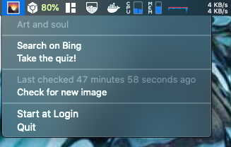

# BingDaily

A fun little side project that downloads the Bing Image of the day and makes it your background on macOS.

- Inspiration: Hammerspoon's [BingDaily](https://www.hammerspoon.org/Spoons/BingDaily.html) spoon.
- Setting macOS Desktop Image: https://www.tech-otaku.com/mac/setting-desktop-image-macos-mojave-from-command-line/



## Running

Download the latest `BingDaily.zip` file from the [releases](https://github.com/dacort/bingdaily/releases) page, unzip and run!

On first run, it will download today's Bing image and make it your background.

You can see the name of the image in your new menu bar item and get more info or open today's quiz using the appropriate links.

It will attempt to update the background every hour while the app is running.

## Notes

I had big issues figuring out how to set the App icon, these links came in handy:
- https://stackoverflow.com/questions/646671/how-do-i-set-the-icon-for-my-applications-mac-os-x-app-bundle
- https://apple.stackexchange.com/questions/325196/applescript-icon-icns-not-changing
- https://stackoverflow.com/questions/11856766/osx-notification-center-icon

At the end of the day, I think it was just cached.

## Releasing

```shell
make zip
```

Then create a new GitHub release and upload.